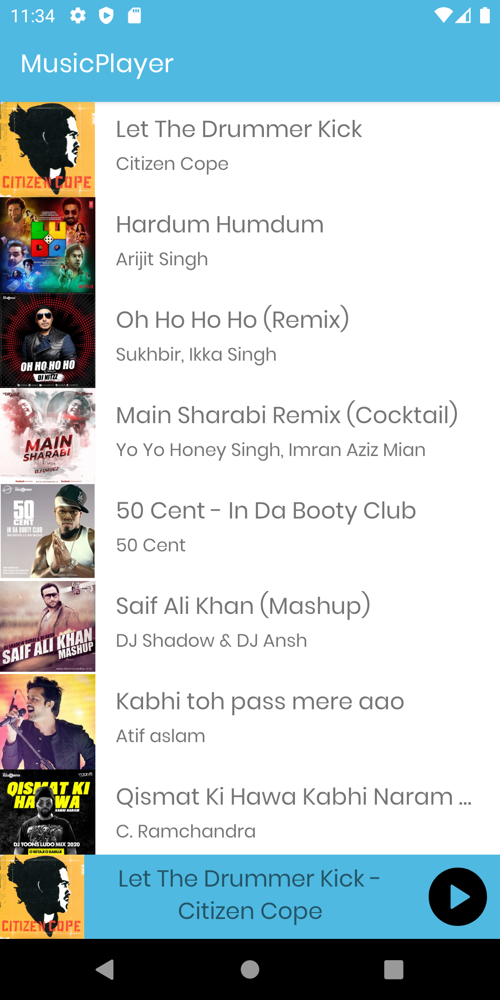
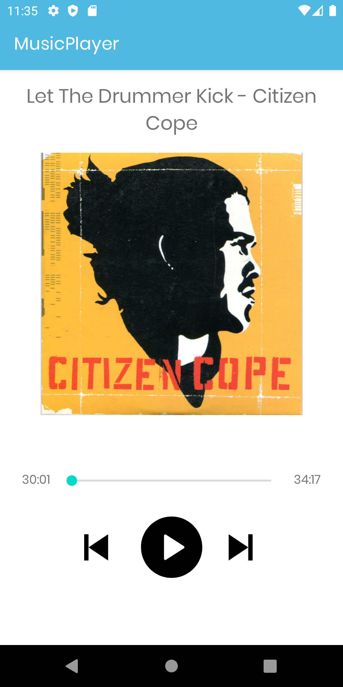

# Music Player
Music player app in Android using the MVVM architecture. This app will have a similar design as Spotify and it will also be designed in a way that is easily extendable with more features.

   
  

## Tech Stack:
* [ViewModel][1] - Stores UI-related data that isn't destroyed on UI changes. 
* [LiveData][2] - for reactive style programming (from VM to UI).
* [Dagger-hilt][3] - for dependency injection.
* [Timber][4] - for logging.
* [Coroutines][5] - A coroutine is a concurrency design pattern that you can use on Android to simplify code that executes asynchronously
* [Glide][6] - Glide is a fast and efficient image loading library for Android 
* [Firestore][7] - Cloud Firestore is a cloud-hosted, NoSQL database that your iOS, Android
* [Navigation component][8] - To navigate between fragments
* [ExoPlayer][9] - ExoPlayer is an application level media player for Android

[1]: https://developer.android.com/topic/libraries/architecture/viewmodel
[2]: https://developer.android.com/topic/libraries/architecture/livedata
[3]: https://dagger.dev/hilt/
[4]: https://github.com/JakeWharton/timber
[5]: https://kotlinlang.org/docs/coroutines-overview.html
[6]: https://bumptech.github.io/glide/
[7]: https://firebase.google.com/docs/firestore
[8]: https://developer.android.com/guide/navigation/navigation-getting-started
[9]: https://exoplayer.dev/

